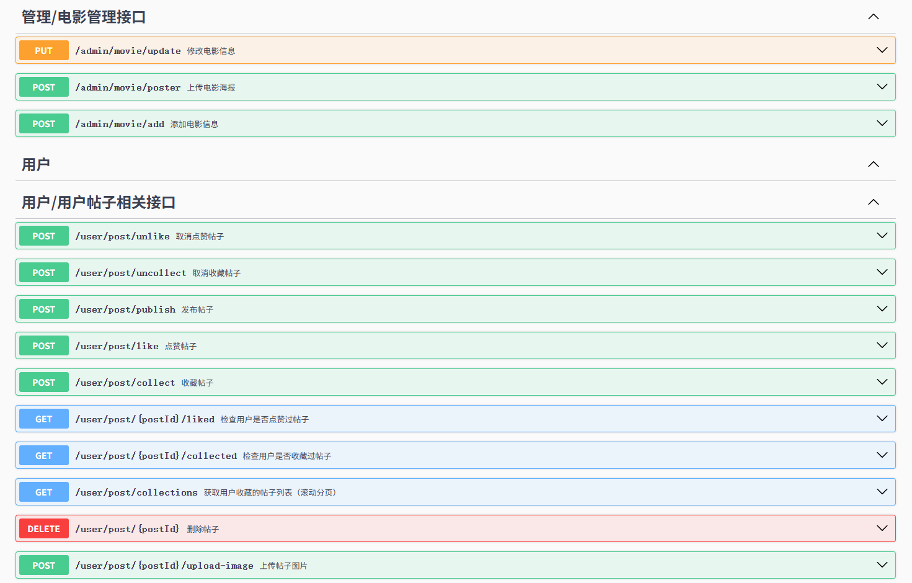

# FilmComment - 电影评论社区项目
## 项目简介
FilmComment 是一个基于 Spring Boot 开发的电影评论平台，集成了 AI 智能总结电影评论功能。用户可以在平台上浏览电影信息、发表影评、参与讨论。
## 背景
随着电影产业的蓬勃发展，用户对电影的讨论和评价需求日益增长，但海量的评论信息给用户快速获取有效观点以及准确避开剧透信息带来了挑战。FilmComment 项目应运而生，旨在构建一个集电影评论发布、互动交流、创建防剧透分区和 AI 智能分析于一体的平台。
## 安装
### 环境要求
JDK 17 及以上

Maven 3.6 及以上

MySQL 8.0 及以上

Redis 6.2 及以上

Ollama （用于 AI 评论分析，需提前下载 qwen2:1.5b 模型）

### 部署步骤
```
git clone <项目仓库地址>
cd FilmComment
```
### 配置数据库
在MySQL Workbench运行FC_DB.sql
### 修改配置文件
复制 application-dev.example.yml为 application-dev.yml并修改配置
### 构建项目
```
# 安装依赖
mvn clean install
```
### 运行项目
```
mvn spring-boot:run
```
或直接运行 FilmApplication.java
### 验证启动
访问：

Swagger UI: http://localhost:8080/swagger-ui.html

API 文档: http://localhost:8080/v3/api-docs

## 使用方法
该项目目前没有前端，
运行后访问Swagger UI 查看和调试：
http://localhost:8080/swagger-ui.html
文档包含接口参数说明、请求示例和响应格式。


## 主要项目负责人
[@3xSu](https://github.com/3xSu)
## 参与贡献方式
### 分支管理：
基于 develop 分支创建功能分支，命名格式为 feature/功能名称 或 fix/问题描述
### 代码规范：
- 遵循 Java 编码规范，使用 Lombok 简化代码
- 关键逻辑需添加注释，确保可读性
- 新增接口需补充 Swagger 文档注释
- 提交规范：提交信息格式为 [类型] 描述，例如：[feat] 添加评论点赞功能、[fix] 修复帖子发布验证bug
### PR 流程：
完成开发后提交 PR 至 develop 分支，通过代码审核后合并
### 联系方式
如有问题或建议，请通过以下方式联系：
- 提交 Issue
- 邮箱：huang1502180208@163.com
## 贡献人员
感谢所有为项目贡献代码和提出建议的开发者。
## 开源协议
本项目采用 MIT 许可证开源，详情参见 LICENSE 文件。